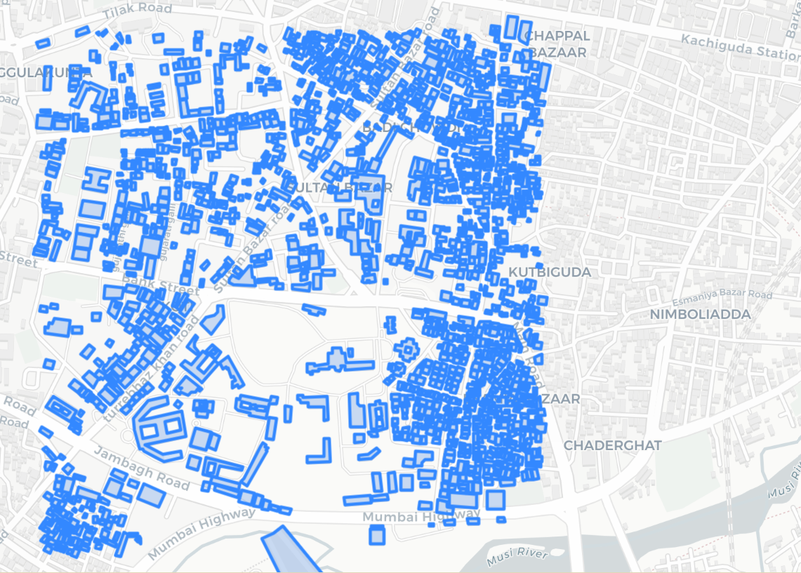

# GIS Analysis of a Small Area in Hyderabad using Python

This is a small project where I tried to analyze a real area in Hyderabad using map data and Python. I wanted to understand how roads and buildings are spread across a neighborhood and answer some basic questions about that area using code.

---

## What is this project about?

Basically, I picked a small area in Hyderabad (roughly 1 km²) and downloaded the map data for it — like roads and buildings. Then I used Python to study that data and answer questions like:

- How many buildings are there?
- How long are all the roads combined?
- How much area do the buildings cover?
- How many buildings are close to the center of that area?

It's not a super complex project but it covers the basic things you do in GIS (Geographic Information Systems) — which is just a fancy way of saying "working with maps and location data using code."

---

## Tools and Libraries I Used

I used Python for everything. Here are the libraries:

- **OSMnx** — this is the main one. It lets you download map data (roads, buildings, etc.) directly from OpenStreetMap just by giving it a location. OpenStreetMap is basically a free version of Google Maps.
- **GeoPandas** — works like Pandas (for tables/dataframes) but for map data. Used this to filter, clean, and calculate things from the map data.
- **Shapely** — used this to create geometric shapes like points and circles in code.
- **Matplotlib** — for making basic plots and maps.
- **Folium** — for making an interactive map that you can zoom in and click around on, like Google Maps.

---

## The Area I Studied

I defined the area using 4 coordinates (west, south, east, north) that form a box around a neighborhood in Hyderabad:

```python
bbox = (78.481, 17.380, 78.491, 17.390)
```

This box covers roughly 1 km² of area. Think of it like drawing a rectangle on Google Maps and saying "I only want data from inside this rectangle."

---

## What I Did — Step by Step

### Step 1 — Downloaded the Data

First I downloaded the road network and buildings inside that box:

```python
G = ox.graph_from_bbox(bbox=bbox, network_type='drive')
buildings = ox.features_from_bbox(bbox=bbox, tags={'building': True})
```

The road data comes as a graph (like a web of lines and dots). The building data comes as shapes (polygons).

---

### Step 2 — Cleaned the Building Data

OSM gives a lot of different types of shapes — points, lines, polygons. For buildings I only needed the actual polygon shapes (the outlines of buildings), so I filtered those out:

```python
buildings = buildings[buildings.geometry.type.isin(['Polygon', 'MultiPolygon'])]
```

This step is important because if you skip it, you'll get wrong counts and errors when calculating area.

---

### Step 3 — Converted Roads into a Table

The road data downloaded as a graph (nodes and edges). I converted it into a regular table format so I could work with it easily:

```python
nodes, edges = ox.graph_to_gdfs(G)
```

- **nodes** = intersections and dead ends
- **edges** = the actual road segments between them

Then I calculated total road length:

```python
total_road_length = edges['length'].sum() / 1000
print("Total road length (km):", total_road_length)
```

---

### Step 4 — Calculated Building Area

This was a slightly tricky part. The building coordinates are stored in latitude and longitude format (EPSG:4326) which is good for showing locations on a map, but not good for measuring area in metres.

So I had to convert it to a different format (EPSG:3857) that works in metres:

```python
buildings_proj = buildings.to_crs(epsg=3857)
buildings_proj['area'] = buildings_proj.area
print("Total building area (sq.m):", buildings_proj['area'].sum())
```

If you skip this conversion step, the area numbers will be completely wrong — this is one of those things that's easy to miss as a beginner.

---

### Step 5 — Calculated Building Density

This is just a simple count of how many buildings are in 1 km²:

```python
building_density = len(buildings) / 1  # study area is ~1 km²
print("Building density (per sq.km):", building_density)
```

Higher the number, more packed the area is.

---

### Step 6 — Found Buildings Near the Center (Buffer Analysis)

This was the most interesting part. I picked the center point of the area, drew a 300 metre circle around it, and checked how many buildings fall inside that circle:

```python
center = Point(78.486, 17.385)
center_gdf = gpd.GeoDataFrame(geometry=[center], crs="EPSG:4326")
center_proj = center_gdf.to_crs(epsg=3857)

buffer = center_proj.buffer(300)
nearby = buildings_proj[buildings_proj.intersects(buffer[0])]
print("Buildings within 300m:", len(nearby))
```

This kind of analysis is used in real life to answer questions like "how many shops are within 500m of a bus stop" or "how many houses are near a hospital."

---

### Step 7 — Made Maps

I made two types of maps:

**Static map using Matplotlib** — just a simple image showing roads and buildings:

```python
fig, ax = plt.subplots(figsize=(8, 8))
edges.plot(ax=ax, linewidth=0.7)
buildings.plot(ax=ax, color='red', alpha=0.5)
plt.title("1 km Area: Roads and Buildings")
plt.show()
```

**Interactive map using Folium** — you can zoom in, click around, and explore the area like a real map.

One thing I ran into — the default Folium map uses OpenStreetMap tiles which gave an "Access Blocked" error. To fix this I switched to CartoDB tiles which are free and work without any API key:

```python
import folium

m = folium.Map(location=[17.385, 78.486], zoom_start=15,
               tiles='CartoDB positron')

# Add buildings to the map
for _, row in buildings.iterrows():
    folium.GeoJson(
        row.geometry,
        style_function=lambda x: {'fillColor': 'red',
                                   'color': 'red',
                                   'fillOpacity': 0.5}
    ).add_to(m)

m.save("hyderabad_map.html")
m
```

The map gets saved as an HTML file which you can open in any browser and interact with.

Here is what the static map output looks like — red shapes are buildings, blue lines are roads:



---

## What I Found Out

| Question | Answer |
|---|---|
| How many buildings are there? | 1,645 buildings |
| How many road segments? | 530 edges, 241 nodes |
| What is the total road length? | 33.17 km |
| What is the total built-up area? | 352,223 sq.m (about 35% of the 1 km² area) |
| How many buildings near the center? | 174 buildings within 300m |
| How dense is the area? | 1,645 buildings per km² |

---

## What I Learned

- How to download real map data using code instead of manually exporting from Google Maps or QGIS
- That you need to convert coordinate systems before calculating distance or area (this was new to me)
- How to work with spatial data using GeoPandas — it's basically Pandas but for maps
- How buffer analysis works — creating a circle and checking what falls inside it
- How to make both static and interactive maps using Python

---

## How to Run This

1. Install the required libraries:
```bash
pip install osmnx geopandas folium matplotlib shapely
```

2. Run the notebook cells one by one in Google Colab or Jupyter Notebook

3. The maps and results will show up inline

---

## Folder Structure

```
project/
│
├── gis_analysis.ipynb        # main notebook with all the code
├── hyderabad_map.html        # interactive Folium map (open in browser)
├── map_output.png            # static map screenshot
├── README.md                 # this file
```


